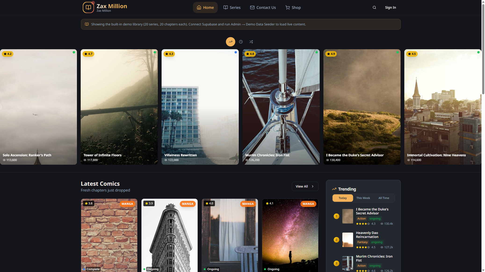

# Zax Million

Premium manga reading platform built with React, Vite, Tailwind CSS, and Supabase.



<p align="center"><em>Dark-mode manga library — featured series, latest comics, and trending</em></p>


## Features

- **Modern reader** — vertical webtoon and page-by-page modes
- **Child theme system** — Cyberpunk Neon, Zen Minimalist, Shiranami Sakura (+ custom themes)
- **Admin dashboard** — series/chapter upload, users, monetization, themes
- **Auth** — email/password sign-up, sign-in, password reset
- **Monetization** — coins, premium chapters, PayPal/Ko-fi support
- **PWA** — installable progressive web app

## Quick start (5 minutes)

```bash
git clone https://github.com/ZAX-MILLION/zax-kodelex.git
cd zax-kodelex
npm install
cp .env.example .env
# Edit .env with your Supabase URL and anon key
npm run dev
```

Open **http://localhost:8080**. On first launch without env vars, the setup wizard guides you through Supabase configuration and admin account creation.

Tip: set `VITE_DEMO_MODE=true` in `.env` to explore the built-in demo library without a database.

## Environment variables

| Variable | Required | Description |
|----------|----------|-------------|
| `VITE_SUPABASE_URL` | Yes (prod) | Supabase project URL |
| `VITE_SUPABASE_ANON_KEY` | Yes (prod) | Supabase anon/public key |
| `VITE_DEMO_MODE` | No | Show demo library when DB is empty |
| `VITE_PAYPAL_CLIENT_ID` | No | PayPal donations on Support page |
| `VITE_SKIP_SETUP` | No | Skip first-run setup wizard |

See [docs/SETUP.md](docs/SETUP.md) for full production setup.

## Scripts

| Command | Description |
|---------|-------------|
| `npm run dev` | Dev server on port **8080** |
| `npm run build` | Production build |
| `npm run lint` | ESLint |
| `npm run typecheck` | TypeScript check |

## Tech stack

- **Frontend:** React 18, TypeScript, Vite, Tailwind, shadcn/ui, TanStack Query
- **Backend:** Supabase (Postgres, Auth, Storage, Edge Functions)
- **Themes:** `child_themes` table → CSS variables → ComponentRegistry

## Documentation

- [Setup guide](docs/SETUP.md) — Supabase, migrations, edge functions, deployment
- [Theme system](docs/THEMES.md) — how child themes work, creating/importing themes
- [Security checklist](docs/SECURITY_CHECKLIST.md)
- [Lint audit](docs/LINT_AUDIT.md)

## Project structure

```
src/
  components/     UI, admin, reader, setup
  contexts/       Auth, feature flags, i18n
  hooks/          Data fetching, SEO, installation
  integrations/   Supabase client
  pages/          Route pages
  themes/         Theme components (numbered child themes)
  utils/          Runtime utilities
  utils/seed/     Demo/seed/reset tooling (dev)
docs/             Setup, theme, and ops documentation
supabase/         Migrations and edge functions
public/           Static assets, sitemap, robots.txt
```

## Support

- Ko-fi: https://ko-fi.com/zaxmi
- Email: contact@zaxmillion.com

## License

© 2026 Zax Million. All rights reserved. See [`LICENSE`](LICENSE) and [`NOTICE`](NOTICE).

**This project must not be used for copyright piracy or other illegal activity.** Users and self-hosters are solely responsible for their content and deployments. Legal pages: [docs/legal](docs/legal/).
