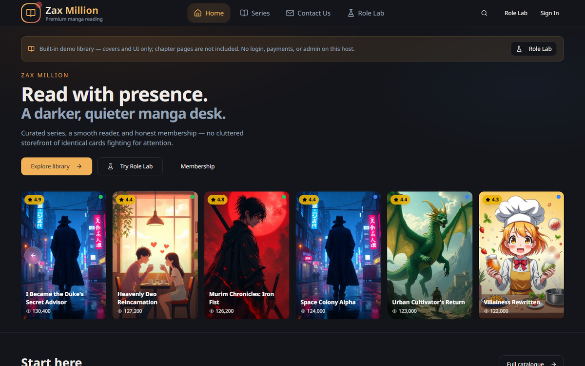
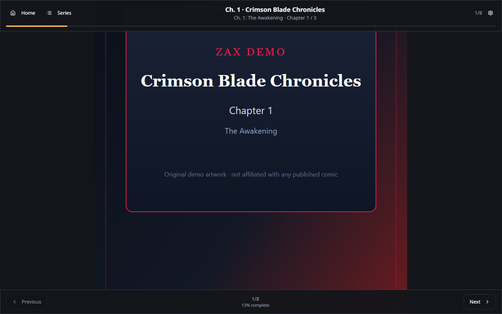
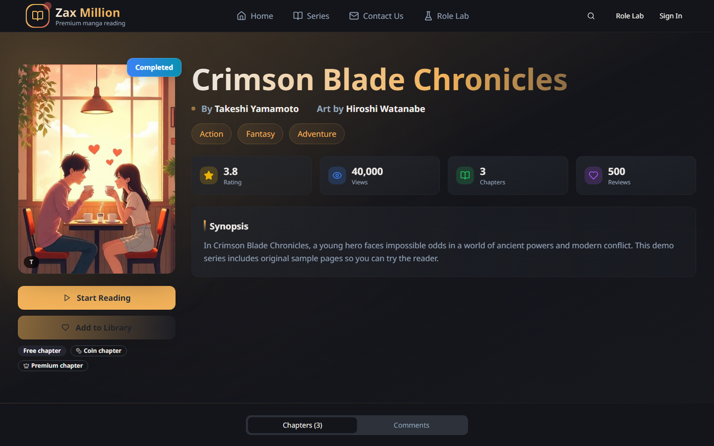
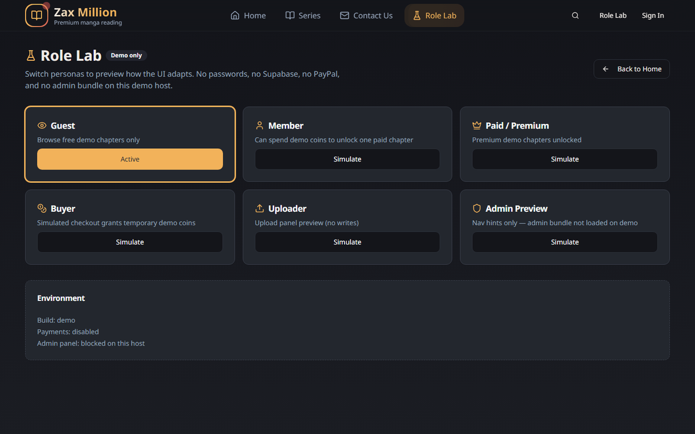
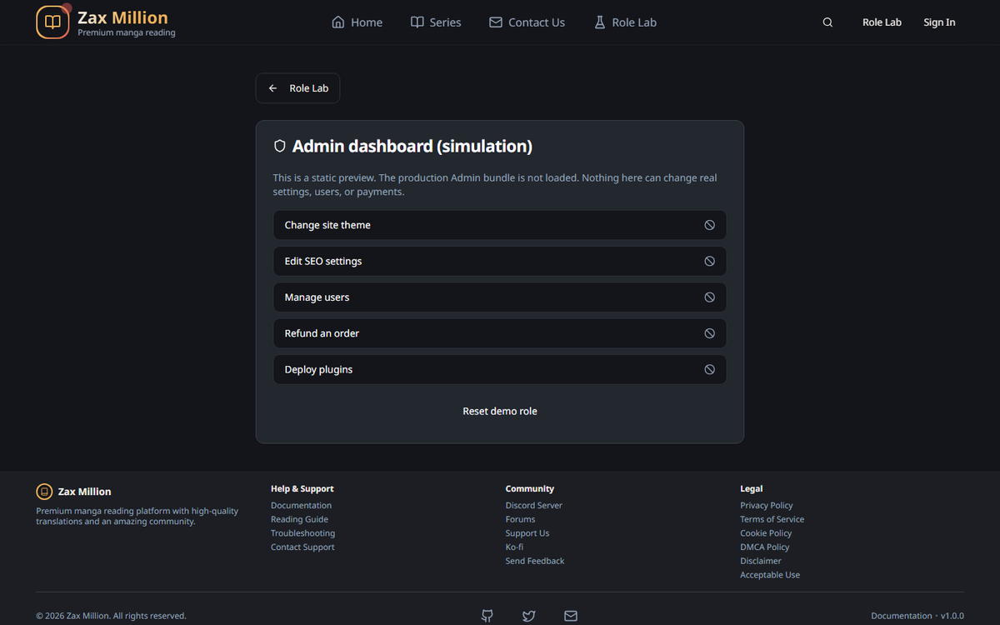
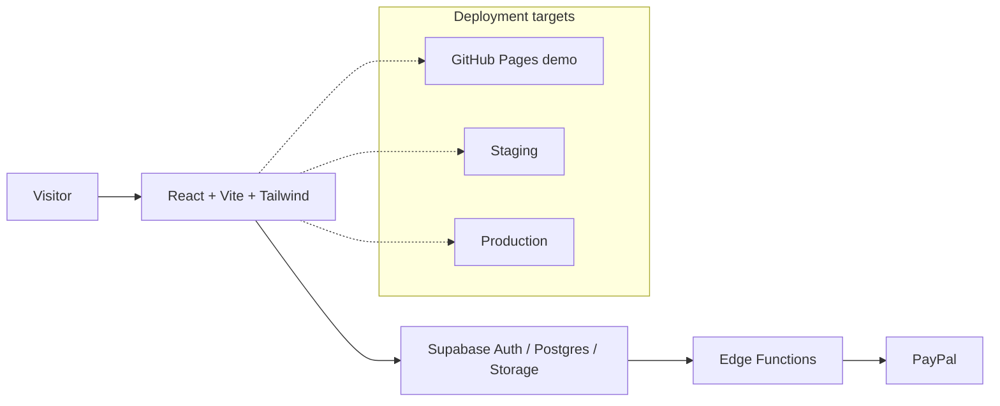

<div align="center">


# ZAX MILLION

**Premium manga, manhwa, webtoon, and novel reading platform**

Modern reader · Publishing tools · Role-based administration · Theme system · Coins & memberships · Safe interactive demo · Mobile-first design

<br />

[](https://zax-million.github.io/zax-kodelex/)
[](LICENSE)
[](https://react.dev/)
[](https://www.typescriptlang.org/)
[](https://vitejs.dev/)
[](https://supabase.com/)
[](https://tailwindcss.com/)
[](https://web.dev/progressive-web-apps/)
[](docs/runbooks/PAYPAL-GO-LIVE.md)
[](docs/releases/seamless-v2/RESPONSIVE-VERIFICATION.md)

<br />

[**View Live Demo**](https://zax-million.github.io/zax-kodelex/)
&nbsp;·&nbsp;
[**Seamless V2 Preview**](https://zax-kodelex.vercel.app/)
&nbsp;·&nbsp;
[**Explore Demo Roles**](https://zax-kodelex.vercel.app/demo)
&nbsp;·&nbsp;
[**Documentation**](docs/SETUP.md)
&nbsp;·&nbsp;
[**Support**](https://ko-fi.com/zaxmi)

</div>

---

## What is ZAX Million?

ZAX Million is a **self-hostable reading and publishing platform** for manga, manhwa, webtoon, and novels. It ships with a polished public experience and the operator tools you need to run a real library—not just a static homepage mock.

| Open immediately | What you get |
|------------------|--------------|
| [Live demo (GitHub Pages)](https://zax-million.github.io/zax-kodelex/) | Public showcase site |
| [Seamless V2 preview](https://zax-kodelex.vercel.app/) | Newest homepage, Role Lab, readable sample chapters |
| [Sample series](https://zax-kodelex.vercel.app/series/00000000-0000-4000-a000-000000000001) | Crimson Blade Chronicles |
| [Sample chapter](https://zax-kodelex.vercel.app/reader/00000000-0000-4000-a000-000000000001/1) | Start reading in one click |
| [Demo blog](https://zax-kodelex.vercel.app/blog) | Local demo articles |

> Preview builds use **demo mode**: no passwords required for Role Lab, no real money charged, no production database writes.

---

## Product showcase

<table>
  <tr>
    <td width="50%">
      
      <p align="center"><sub>Homepage — editorial discovery</sub></p>
    </td>
    <td width="50%">
      
      <p align="center"><sub>Reader — vertical webtoon experience</sub></p>
    </td>
  </tr>
  <tr>
    <td width="50%">
      
      <p align="center"><sub>Series — covers, chapters, continue reading</sub></p>
    </td>
    <td width="50%">
      
      <p align="center"><sub>Role Lab — temporary personas</sub></p>
    </td>
  </tr>
</table>

<p align="center">
  
  <br />
  <sub>Admin simulation — session-only demo dashboard (production Admin bundle is never loaded on the public demo)</sub>
</p>

---

## Features

### Reading experience

- Vertical webtoon reader and page-by-page modes
- Progress display and previous/next navigation
- Free, coin-locked, and premium chapter gates (demo-aware)
- Mobile-first layout with safe-area spacing
- Images clamped to the viewport — no horizontal scroll traps

### Content discovery

- Featured hero, latest releases, trending
- Browse, search, categories, and series detail
- Demo blog for updates and guides
- Membership and trust sections on the seamless homepage

### Publishing tools

- Series and chapter management (production)
- Uploader simulation on the public demo
- Draft preview flows
- Cover and metadata handling
- Moderation-oriented review UI (simulated in demo)

### Administration

- User and content workflows (production Admin)
- Lightweight **Admin simulation** for public demos
- Theme management and monetization overview
- Analytics surfaces and security controls (production)

### Monetization

- Coin wallets and premium memberships
- Digital license catalogue
- PayPal architecture with sandbox path
- Demo checkout that never charges real money

### Customization

- Child themes (Cyberpunk Neon, Zen Minimalist, Shiranami Sakura, …)
- CSS-variable design system + component registry
- Theme previews before activation
- Responsive layouts from 320px phones to large desktops

---

## Interactive demo & Role Lab

Try the product as different personas — **no account and no password**:

| Role | What it previews | Open |
|------|------------------|------|
| Guest | Free sample chapters | [Role Lab](https://zax-kodelex.vercel.app/demo) |
| Member | Coin unlocks & member UI | [/demo/member](https://zax-kodelex.vercel.app/demo/member) |
| Paid Member | Premium access | [/demo/paid-member](https://zax-kodelex.vercel.app/demo/paid-member) |
| Buyer | Temporary wallet & checkout | [/demo/buyer](https://zax-kodelex.vercel.app/demo/buyer) |
| Uploader | Upload form (no writes) | [/demo/uploader](https://zax-kodelex.vercel.app/demo/uploader) |
| Administrator | Simulated dashboard | [/demo/admin](https://zax-kodelex.vercel.app/demo/admin) |

**Guarantees**

- No real money is charged
- No production data is changed
- Demo state lives in the browser session and clears with **Reset Demo**

---

## Architecture



| Target | Purpose |
|--------|---------|
| **Demo** | Static showcase — Role Lab, sample chapters, no live payments |
| **Staging** | Your Supabase + PayPal sandbox |
| **Production** | Live domain, production Supabase, verified merchant PayPal |

---

## Quick start

### Try demo mode (no Supabase)

```bash
git clone https://github.com/ZAX-MILLION/zax-kodelex.git
cd zax-kodelex
npm install
cp .env.example .env
```

In `.env`:

```env
VITE_APP_ENV=demo
VITE_DEMO_MODE=true
VITE_DISABLE_PAYMENTS=true
VITE_DISABLE_ADMIN=true
```

```bash
npm run dev
```

Open **http://localhost:8080** — use **Try Demo** for Role Lab personas.

<details>
<summary><strong>Full installation (Supabase + admin)</strong></summary>

1. Create a Supabase project
2. Apply migrations from `supabase/migrations/`
3. Configure Storage buckets and Edge Functions as described in [docs/SETUP.md](docs/SETUP.md)
4. Set in `.env`:

```env
VITE_APP_ENV=staging
VITE_SUPABASE_URL=https://YOUR_PROJECT.supabase.co
VITE_SUPABASE_ANON_KEY=YOUR_ANON_KEY
```

5. `npm run dev` → complete the setup wizard / create an admin account
6. For production, set `VITE_APP_ENV=production` and follow [docs/SETUP.md](docs/SETUP.md) plus the security & PayPal runbooks

</details>

| Script | Purpose |
|--------|---------|
| `npm run dev` | Local server on port **8080** |
| `npm run build` | Production build |
| `npm run build:demo` | Static demo build (payments/admin off) |
| `npm run typecheck` | TypeScript |
| `npm test` | Unit tests |
| `npm run lint` | ESLint |

---

## Project status

| Item | Status |
|------|--------|
| Public demo | Available on [GitHub Pages](https://zax-million.github.io/zax-kodelex/) |
| Seamless V2 preview | Available for review ([Vercel demo build](https://zax-kodelex.vercel.app/)) |
| Typecheck / unit tests | Verified on the Seamless V2 branch |
| Demo GitHub Pages deploy | Workflow on `main` push |
| PayPal architecture | Implemented (sandbox path) |
| Live PayPal capture | Requires merchant configuration + successful live transaction |
| Production backend | Requires your Supabase project |

---

## Roadmap

- [ ] GitHub Pages root deployment (user-site URL)
- [ ] Staging Supabase wired end-to-end
- [ ] PayPal Sandbox verification with merchant credentials
- [ ] Production domain cutover
- [ ] Additional child themes
- [ ] Marketplace packaging
- [ ] Documentation expansions for operators

Draft release notes: [docs/releases/v2.0.0-RELEASE-NOTES.md](docs/releases/v2.0.0-RELEASE-NOTES.md)

---

## Documentation

| Guide | When you need it |
|-------|------------------|
| [Setup](docs/SETUP.md) | Supabase, migrations, edge functions, deploy |
| [GitHub Pages demo](docs/GITHUB_PAGES_DEMO.md) | How the public demo stays online |
| [Themes](docs/THEMES.md) | Create and import child themes |
| [Security checklist](docs/SECURITY_CHECKLIST.md) | Before go-live |
| [PayPal go-live](docs/runbooks/PAYPAL-GO-LIVE.md) | Merchant activation |
| [Legal](docs/legal/) | Terms, Privacy, DMCA, Acceptable Use |

---

## Support & contact

| Channel | Link |
|---------|------|
| Email | [ZAXMIllion@proton.me](mailto:ZAXMIllion@proton.me) |
| Ko-fi | [ko-fi.com/zaxmi](https://ko-fi.com/zaxmi) |
| Issues | [GitHub Issues](https://github.com/ZAX-MILLION/zax-kodelex/issues) |
| Security | Prefer email for sensitive reports; see [SECURITY_CHECKLIST](docs/SECURITY_CHECKLIST.md) |
| Docs | [docs/SETUP.md](docs/SETUP.md) |

---

## License & responsible use

MIT — see [`LICENSE`](LICENSE) and [`NOTICE`](NOTICE).

- The license covers **the software code**
- It does **not** grant rights to copyrighted manga or other third-party content
- Operators must publish **original or properly licensed** material only
- ZAX Million is not responsible for unauthorized content hosted by third parties

Details: [docs/legal](docs/legal/)

---

<div align="center">

**Read more. Publish better. Ship yours.**

[Live Demo](https://zax-million.github.io/zax-kodelex/) · [Seamless Preview](https://zax-kodelex.vercel.app/) · [Star on GitHub](https://github.com/ZAX-MILLION/zax-kodelex)

</div>
